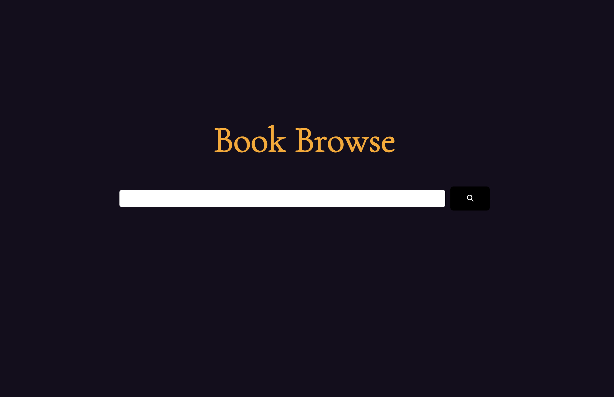
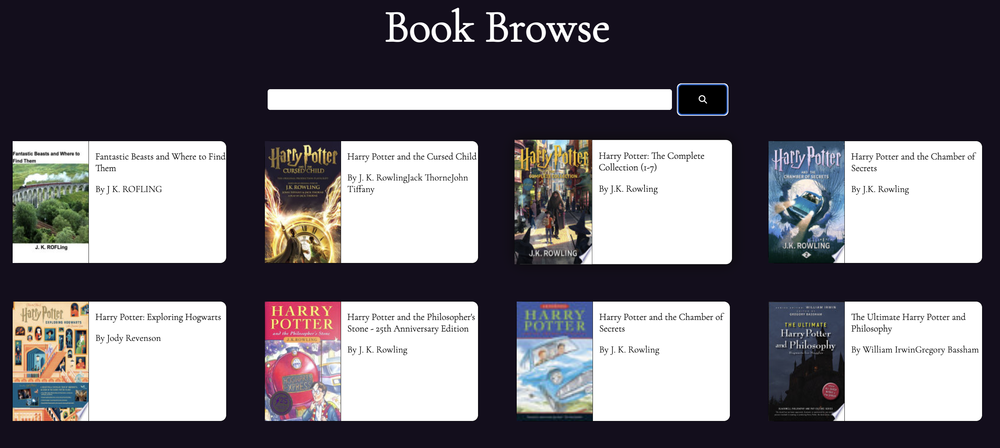
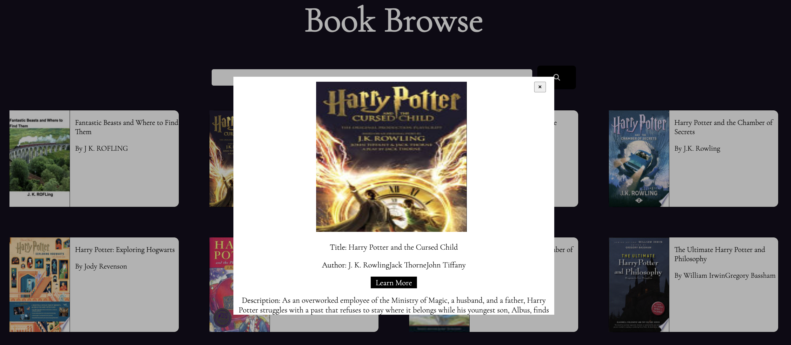

# Project Features

# Overview
To create a web application that fetches data from the Google Books API and displays them on the screen. Further information about the books (image, description, preview link) should be displayed. 

# MVP
- Create a page that allows users to search for books Page should include the following:

- Header section introducing the page

- Form containing a text input and a submit / search button

- A grid of books

# Instructions:

- When the submit button is clicked you need the request books from the Google books API using the input value as your query string
- The books that you receive should be rendered in the books grid.
- Each book in the grid should have an image, author, title and description
- The grid should be responsive on different screen sizes
- You should use async / await for your request code, NOT .then (.then in react components is fine)

# Styling (required):

- This application should look good, take some time to pick a palette and plan out your design. You can use tools like Figma or wireframe pro to plan what your application is going to look like.

- You must use SCSS Modules for component styling
- Your palette should use variables
- Application Design (reccomendations ):

- Functions should do 1 thing, and should be as pure and reusable as possible
- Consider using functions to clean your data, rather than conditional rendering in your components
- Use a container component for loading data
- React components should be as dumb as possible (rely on props)
- Always use iterators over loops
- Always parametrize and abstract large pieces of duplicate code.

# Tech Stack

- React
- SCSS# book-browse
